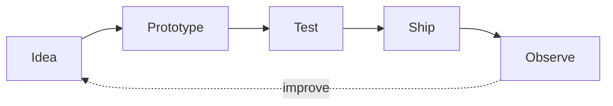

<div align="center">

<a href="https://github.com/aayushgoel1607">
  
</a>

<br/>

[](https://scholar-sphere-beta.vercel.app/)
[](mailto:aayush.goel2026@vitstudent.ac.in)
[](https://github.com/aayushgoel1607)

<sub>BUILDING AT THE INTERSECTION OF <b>LEARNING × PLAY × PRODUCT ENGINEERING</b></sub>

</div>

---

### `> whoami`

I’m **Aayush Goel** — a developer who likes turning ambitious ideas into products people can actually enjoy using. I care about thoughtful interaction, reliable systems, and the tiny details that make software feel alive.

Right now, I’m building **ScholarSphere**: one connected learning world where focused study and game-based practice strengthen the same progress loop.

```text
current_mode   shipping full-stack learning experiences
curious_about  adaptive systems · product design · playful UX
building_with  Next.js · TypeScript · Supabase · React
```

<div align="center">

[PROJECT](#-flagship-project) · [SYSTEM](#-inside-the-system) · [STACK](#-toolkit) · [ACTIVITY](#-github-signal) · [CONTACT](#-connect)

</div>

## ✦ Flagship project

<a href="https://scholar-sphere-beta.vercel.app/">
  
</a>

<table>
<tr>
<td width="50%" valign="top">

#### 🎮 Game Learning

Turn PDFs, slides, documents, Wikipedia topics, and curated material into adaptive practice across five pixel-inspired game modes.

- Source-grounded questions
- Adaptive levels and streaks
- Five distinct learning games
- Feedback, rewards, and progress

</td>
<td width="50%" valign="top">

#### ⏱️ Focus Desk

Move from intention to action with a persistent focus timer, quest-board planning, subjects, calendar views, and meaningful analytics.

- Pomodoro and custom sessions
- Quest board and daily goals
- Study analytics and history
- Persistent cross-device progress

</td>
</tr>
</table>

<div align="center">

[](https://scholar-sphere-beta.vercel.app/)
[](#-inside-the-system)

</div>

<details>
<summary><b>◉ Expand the product map</b></summary>
<br/>

| Layer | What it does |
|---|---|
| **Learn** | Turns learner-selected material into validated, source-aware practice |
| **Play** | Delivers adaptive questions through Flashcard Forge, Kart Quest, Dino Dash, Star Defender, and Candy Circuit |
| **Focus** | Connects timers, subjects, goals, planned blocks, tasks, and calendars |
| **Progress** | Unifies credits, streaks, rewards, ranks, history, and personal bests |
| **Protect** | Uses Supabase authentication, row-level security, and guarded reward flows |

</details>

## ⌁ Inside the system

<div align="center">
  
</div>

The project is designed as one loop—not two disconnected tools. Practice earns progress. Focus earns progress. Rewards and history flow back into the same learner profile.

## ⌘ Toolkit

<div align="center">


</div>



## ◫ GitHub signal

<div align="center">

<a href="https://github.com/aayushgoel1607?tab=overview">
  
</a>

<sub>For the live contribution calendar and repository activity, open the GitHub overview below.</sub>

[](https://github.com/aayushgoel1607?tab=overview)

</div>

## ↗ Connect

If you’re building something around **education, thoughtful software, or playful interaction**, I’d love to hear about it.

<div align="center">

[](mailto:aayush.goel2026@vitstudent.ac.in)


<sub>DESIGNED WITH INTENT · BUILT WITH CURIOSITY · ALWAYS ITERATING</sub>

</div>
